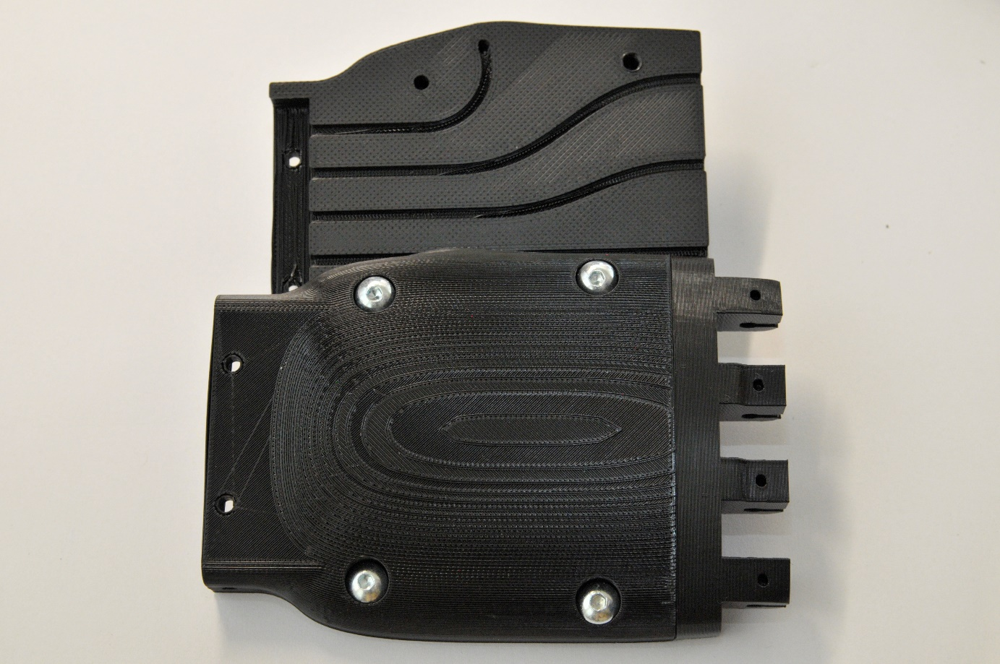
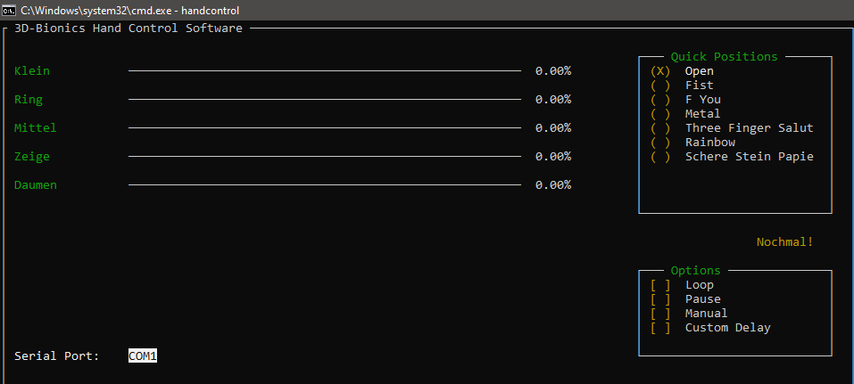
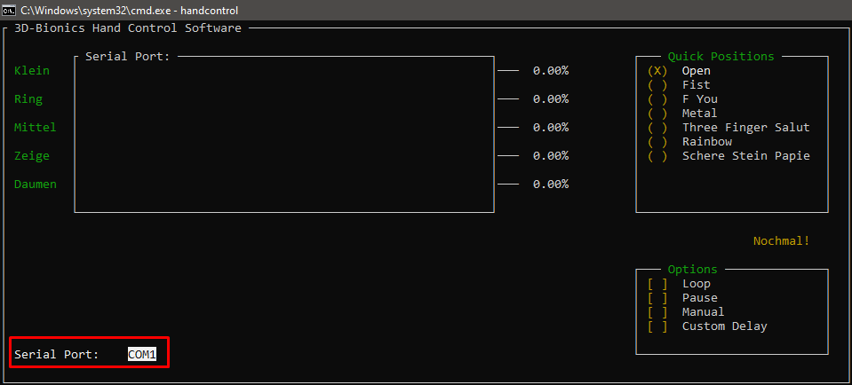

#  Einleitung

## Allgemeine Warnhinweise

Die 3D-Bionic-Hand dient hauptsächlich als Lehr- und Übungsmaterial. Es ist zwar möglich leichte Objekte zu heben, dennoch hat die Bionic Hand, bei weitem nicht die Griffkraft und Stabilität einer Roboterhand. Da durch individuelle Anpassungen oder Änderungen der Software, die Funktionsfähigkeit der Hand nicht garantiert werden kann, sollte der originale Programmcode immer verfügbar sein.

## Anwendergruppen

Die 3D-Bionic-Hand richtet sich vor allem an Personen, die sich entweder für 3D-Druck oder für Mikrocontrollerprogrammierung interessieren. Somit sind die größten Anwendergruppen private Interessenten, die sich selbst weiterbilden oder einfach nur üben möchten und Bildungseinrichtungen, wie Schulen, welche die 3D-Bionic-Hand als Vorführ- oder Lehrmaterial nutzen wollen.

## Definitionen und Akronyme

**Nutzer / Kunde** = Mit Nutzer / Kunde werden alle Personengruppen beschrieben, die dieses Produkt verwenden.

**Kontrollsoftware** = Die Kontrollsoftware ist die Software, die der Nutzer ausführt, um die Bionic Hand zu steuern. Diese Software kommuniziert über die serielle Schnittstelle mit dem Arduino, worüber die Hand gesteuert wird.

**Arduino / Mikrocontroller =** Arduinos sind Mikrocontroller, die es in vielen verschieden Ausführungen gibt. Im Fall der Bionic Hand kommt ein Arduino Nano zum Einsatz. Der Arduino ist für die Steuerung der Servomotoren in der Hand verantwortlich.

**Servomotor** = Servomotoren sind kleine Elektromotoren, die im Unterarm der Bionic Hand verbaut sind und an den Fäden der Finger ziehen, um diese zu bewegen.

#  Zusammenbau der Hand

Die Handfläche wird in drei Teilen gedruckt. Dazu kommen dann noch jeweils fünf Teile pro Finger. Im ersten Schritt müssen die Fäden, die später für das Einknicken der Finger verantwortlich sind, in die Fadenführungen in der Handfläche reingelegt werden. Danach werden beide Handflächen Teile mit den Fingerwurzeln verschraubt. Die einzelne Komponente der Finger, werden durch Metallstifte zusammengehalten. Danach wird der Faden durch den Finger gezogen und oben in der Fingerkuppe verknotet. Die Teile des Unterarms werden ebenfalls mit Schrauben an der Handfläche befestigt. Im nächsten Schritt werden die Elektrischen Teile im Unterarm montiert und die Fäden, mit den Servorädern, an den Servomotoren befestigt. Dabei muss unbedingt darauf geachtet werden, dass die Fäden straff zwischen den Fingerkuppen und den Servomotorn gespannt werden, da sich die Finger sonst nicht ganz schließen lassen.

#  Installation der Software

Um die Kontrollsoftware installieren zu können, ist es nötig, das `.gz` Archiv auf <https://github.com/3D-Bionics/Hand-Handcontrol/releases> herunter zu laden. Als nächstes ist es nötig, in einer Python Konsole, in das Verzeichnis der Datei zu navigieren, um die Software mit dem Befehl `pip install (Archivname)` zu installieren.

#  Nutzung der Software

Um die Kontrollsoftware aufzurufen, muss am Ende nur noch `handcontrol` in der Konsole eingegeben werden und die Software startet. Es kann sein, dass die Software nicht im PATH verlinkt ist. In diesem Fall kann das Program über den Befehl `python -m handcontrol` ausgeführt werden.

Mit der Software lassen sich dann alle Finger einzeln steuern oder man wählt eine der verfügbaren „Quick Positions“ aus. Neben diesen beiden Funktionen gibt es auch noch mehrere Optionen, die sich, im Zusammenhang mit den Quick Positions auswählen lassen.

Diese vier Optionen sind „Loop“, „Pause“, „Manuel“ und „Custom Delay“. Bei der Option „Loop“ wird die aktuell ausgewählte Quick Position laufend wiederholt, „Pause“ pausiert die Animation, die Option „Manuel“ erlaubt es dem Nutzer, jeden Finger separat einzustellen und mit „Custom Delay“ lässt sich eine Verzögerung zwischen den einzelnen Wiederholungen auswählen.

Des Weiteren lässt sich, unten links in der Software, der Serial Port wählen.

In dem User Interface lässt sich nur über die Tastatur navigieren. Die benötigten Tasten dafür sind die Pfeiltasten, die Leertaste, sowie Shift und Tab.

## Definieren von eigenen Positionen und Animationen

Es ist möglich eigene Quick-Positionen oder Animationen im Code festzulegen. Alle Positionen sind festgelegt in der Datei `positions.py`.

Genauere Anweisungen sind in der Datei selbst zu finden.
